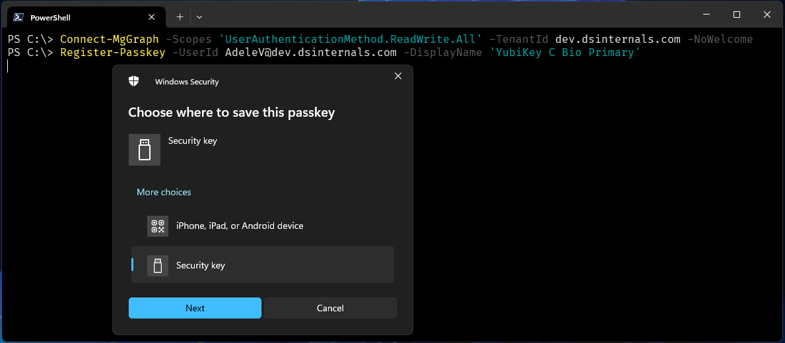
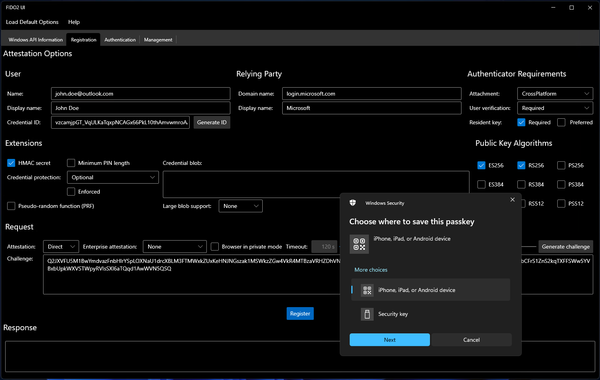

# WebAuthn Interop Assembly Project

[](../LICENSE)
[](#)
[](#)
[](#)
[](https://github.com/MichaelGrafnetter/webauthn-interop/actions)

**Passkeys / FIDO2 / W3C Web Authentication .NET Library for Windows Desktop and CLI Applications**

## Interop Assembly

The `DSInternals.Win32.WebAuthn` library allows .NET applications to directly interact with Passkeys (e.g. [Windows Hello](https://support.microsoft.com/en-us/windows/passkeys-in-windows-301c8944-5ea2-452b-9886-97e4d2ef4422), [Microsoft Authnticator](https://learn.microsoft.com/en-us/entra/identity/authentication/how-to-register-passkey-authenticator), [YubiKey](https://www.yubico.com/products/), [Feitian](https://www.ftsafe.com/products/FIDO), or [Crayonic](https://www.crayonic.com/)) on Windows.
It provides a managed wrapper of the low-level [Windows 10+ WebAuthn API](https://learn.microsoft.com/en-us/windows/win32/api/_webauthn/)
(defined in the [`webauthn.h`](https://github.com/microsoft/webauthn/blob/master/webauthn.h) header file and implemented in the `webauthn.dll` system library). This API is mainly used by browsers
(see the source code of [Chromium](https://chromium.googlesource.com/chromium/src/+/refs/heads/master/device/fido/win/webauthn_api.cc)
and [Firefox](https://searchfox.org/mozilla-central/source/dom/webauthn/WinWebAuthnService.cpp)) to implement passwordless web authentication,
but it can also be used by any .NET desktop or CLI application.

The `DSInternals.Win32.WebAuthn.Adapter` library additionally uses classes defined in the [Fido2.Models](https://www.nuget.org/packages/Fido2.Models/) package as its front-end, which it then translates to native C structures. See the [project site](https://github.com/abergs/fido2-net-lib) for more details.

## PowerShell Module

The [DSInternals.Passkeys](https://www.powershellgallery.com/packages/DSInternals.Passkeys) PowerShell module uses the `DSInternals.Win32.WebAuthn` library together with the [Microsoft Graph API](https://learn.microsoft.com/en-us/graph/api/resources/fido2authenticationmethod?view=graph-rest-beta) and the [Okta API](https://developer.okta.com/docs/api/openapi/okta-management/management/tag/UserFactor/#tag/UserFactor/operation/enrollFactor) to provide Microsoft Entra ID and Okta administrators respectively the capability of registering passkeys on behalf of other users:



See [Yubico's blog](https://www.yubico.com/blog/microsoft-strengthens-phishing-resistant-security-for-entra-id-with-fido2-provisioning-apis/) for more details on the API.

## FIDO2 UI

The project also contains a simple Windows GUI tool called `FIDO2 UI`, which is built on top of the `DSInternals.Win32.WebAuthn` library:



The only purpose of this tool is to demonstrate the usage of the WebAuthn API.

## Downloads

[](https://github.com/MichaelGrafnetter/webauthn-interop/releases)
[](https://www.powershellgallery.com/packages/DSInternals.Passkeys/)
[](https://www.nuget.org/packages/DSInternals.Win32.WebAuthn/)

- The `DSInternals.Passkeys` PowerShell module is published in the [PowerShell Gallery](https://www.powershellgallery.com/packages/DSInternals.Passkeys).
- The latest version of the `FIDO2 UI` can be downloaded from the [Releases section](https://github.com/MichaelGrafnetter/webauthn-interop/releases/latest).
- The `DSInternals.Win32.WebAuthn` library is published in the [NuGet Gallery](https://www.nuget.org/packages/DSInternals.Win32.WebAuthn/).

## .NET API Usage

### Overview

The WebAuthn API is only supported on Windows 10 1903 and newer. It is exposed in the [DSInternals.Win32.WebAuthn](../Documentation/API/DSInternals.Win32.WebAuthn.md) namespace, with the [WebAuthnApi](../Documentation/API/DSInternals.Win32.WebAuthn/WebAuthnApi.md) class being the main entry point.

Following are code samples that mimic the behavior of [login.microsoftonline.com](https://login.microsoftonline.com).
The samples are not ready for production use, as they are missing validation and contain many hardcoded values. Especially the `challenge` must be randomly generated in a cryptographically safe way.

### Registration (Attestation)

Credential registration is performed by calling the [AuthenticatorMakeCredential](../Documentation/API/DSInternals.Win32.WebAuthn/WebAuthnApi/AuthenticatorMakeCredential.md) or [AuthenticatorMakeCredentialAsync](../Documentation/API/DSInternals.Win32.WebAuthn/WebAuthnApi/AuthenticatorMakeCredentialAsync.md) method:

```cs
var rp = new RelyingPartyInformation()
{
    Id = "login.microsoft.com",
    Name = "Microsoft"
};

var user = new UserInformation()
{
    Name = "john.doe@outlook.com",
    DisplayName = "John Doe",
    Id = Base64UrlConverter.FromBase64UrlString("TUY65dH-Otl4jMdTRvlFQ1aApACYsuqGKSPQDQc1Bd4WVyw")
};

var challenge = new byte[] { 0, 1, 2, 3 };
var api = new WebAuthnApi();

var response = api.AuthenticatorMakeCredential(rp, user, challenge, UserVerificationRequirement.Required, AuthenticatorAttachment.Any);
```

### Authentication (Assertion)

Authentication using a previously registered credential is performed by calling the [AuthenticatorGetAssertion](../Documentation/API/DSInternals.Win32.WebAuthn/WebAuthnApi/AuthenticatorGetAssertion.md) or [AuthenticatorGetAssertionAsync](../Documentation/API/DSInternals.Win32.WebAuthn/WebAuthnApi/AuthenticatorGetAssertionAsync.md) method:

```cs
var api = new WebAuthnApi();
var challenge = new byte[] { 0, 1, 2, 3 };
var response = api.AuthenticatorGetAssertion("login.microsoft.com", challenge, UserVerificationRequirement.Required, AuthenticatorAttachment.CrossPlatform);
```

See the [full API documentation](../Documentation/API/DSInternals.Win32.WebAuthn.md) for more information on using this library.

## Troubleshooting

### Rohitab API Monitor

Rohitab API Monitor can be used to [analyze WebAuthn API calls made by browsers](../Documentation/Rohitab/README.md):


### Windows Event Viewer

Windows 10 creates very detailed logs of WebAuthn API calls and CTAP commands. The logs can be displayed in the built-in
**Event Viewer** console under **Applications and Services Logs &rarr; Microsoft &rarr; Windows &rarr; WebAuthN &rarr; Operational**:


## Microsoft's Documentation

- [WebAuthn APIs for password-less authentication on Windows 10](https://learn.microsoft.com/en-us/windows/win32/api/webauthn/)
- [C header file](https://github.com/microsoft/webauthn/blob/master/webauthn.h)
- [Graph API Create fido2AuthenticationMethod](https://learn.microsoft.com/en-us/graph/api/authentication-post-fido2methods?view=graph-rest-beta)

## Acknowledgements

- This project uses the [FIDO2 .NET Library](https://github.com/abergs/fido2-net-lib). Huge thanks to its contributors, mainly @abergs and @aseigler.
- There are at least 2 similar projects, in various stages of completeness:
  - [Yoq.Windows.WebAuthn](https://github.com/dbeinder/Yoq.Windows.WebAuthn)
  - [HelloSample](https://github.com/aseigler/HelloSample)
