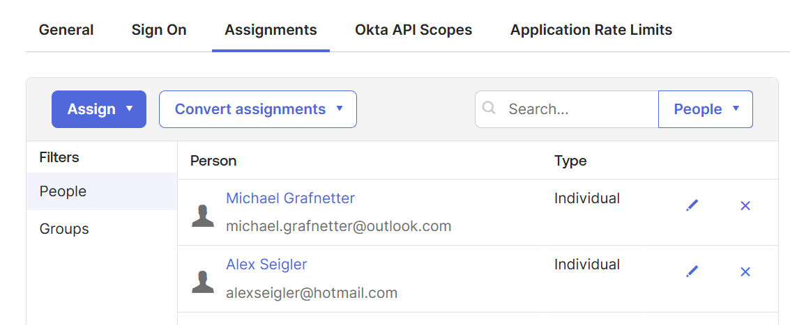

# Okta Setup

## Intro

In order to use the Okta-reted cmdlets ([Connect-Okta](Connect-Okta.md),
[Disconnect-Okta](Disconnect-Okta.md), [New-Passkey](New-Passkey.md),
[Register-Passkey](Register-Passkey.md), and [Get-PasskeyRegistrationOptions](Get-PasskeyRegistrationOptions.md)),
you will need to create an application within your Okta tenant.
You may use the authorization code flow with PKCE (highly recommended for interactive login),
or the client credentials flow (for headless use). If you are unsure which to choose,
select the authorization code flow, as it is the most secure option.

## Authorization code flow with PKCE setup

To use the authorization code flow, you will need to create a Single Page App (SPA).
In the application area in the Okta admin console, click `Create App Integration`,
then select `OIDC - OpenID Connect` for the sign-in method, then `Single-Page Application` for the application type, and click next.

> [!Note]
> This process is nearly identical to [User-based API access setup](https://developer.okta.com/docs/reference/rest/#user-based-api-access-setup)
> in the Okta developer documentation.


On the next page, give the app integration a meaningful name.
Under assignments, select either `Limit access to selected groups` if you already have a group you want to assign this application to,
or select `Skip group assignment for now`. You can change this later, but you are required to select an option.
Everything else can be left at the defaults. Click save.


> [!Warning]
> Do NOT, under ANY circumstances, select `Allow everyone in your organization to access`.
> Use one of the other options. This is your warning. Seriously. Do not do this.


On the next page, ensure that Proof Key for Code Exchange (PKCE) is selected, and note the client ID,
you will need this to connect.


On the Assignments tab, assing the application to the appropriate user(s).
On the Okta API Scopes tab, scroll down to the `okta.users.manage` scope and click the `Grant` button
to the right of the scope name. This is the minimal permission required to use this library,
since the whole point of the library is to register a passkey on behalf of someone else.
This scope allows the app to create new users and to manage all users' profile and credentials information.
Be very, very careful assigning this app.

Okta API scopes should look approximately like this:


Assignments tab should look something like this:



## Client credentials flow setup

If you intend to use the client credentials flow, you must set up an API service application as described below.

> [!Note]
> This process is nearly identical to the [Service-based API access setup](https://developer.okta.com/docs/reference/rest/#service-based-api-access-setup)
> in the Okta developer documentation.


On the next page, give the app integration a meaningful name. Click save.


On the next page, note the client ID, you will need this to connect.
Switch the client authentication configuration from the default client secret to public key/private key by clicking edit,
then selecting the radio button.


The public keys configuration section will open. For a simple test configuration, leave the radio button for save keys to Okta selected. You will need to add at least one key here, by clicking the add key button.


The add a public key dialog will appear.
You have the option to paste in your own public key,
or let Okta generate one based on RS256 for you by clicking generate new key.


Leave the private key format at the default JSON, and click the copy to clipboard button. Save the contents in a safe place, as this key is a sensitive credential, then click save.


You can optionally compress the output to avoid potential issues later.
In the compressed format the key is ready to use as a parameter value to the [-JsonWebKey parameter](Connect-Okta.md#-jsonwebkey)

```powershell
PS C:\> $jwk = @'
{
  "kty": "RSA",
  "e": "AQAB",
  "kid": "EE3QB0WvhuOwR9DuR6717OERKbDrBemrDKOK4Xvbf8c",
  "d": "TmljZSB0cnkhICBCdXQgdGhpcyBpc24ndCBhIHJlYWwga2V5Lg",
  "p": "wqFCdWVuIGludGVudG8hIFBlcm8gZXN0YSBubyBlcyB1bmEgY2xhdmUgcmVhbC4",
  "q": "TmV0dGVyIFZlcnN1Y2ghIEFiZXIgZGFzIGlzdCBrZWluIGVjaHRlciBTY2hsw7xzc2VsLg",
  "dp": "QmVsbGUgdGVudGF0aXZlICEgTWFpcyBjZSBuJ2VzdCBwYXMgdW5lIHZyYWllIGNsw6ku",
  "dq": "5LiN6ZSZ55qE5bCd6K-V77yB5L2G6L-Z5LiN5piv55yf5q2j55qE6ZKl5YyZ44CC",
  "qi": "7KKL7J2AIOyLnOuPhOuEpOyalCEg7ZWY7KeA66eMIOydtOqxtCDsp4Tsp5wg7Je07Ieg6rCAIOyVhOuLiOyXkOyalC4",
  "n": "uT64MHF-qH5F-jLAoWxuwI8_YJ2cdkMIjvlyazJnB0xjvtddS14O8cfDHW2lxHWiOor-jarCK282WC1BukjnizCeUl7YoWDWnVNOcQd1hi__nC5cjhgnjVPNgBiRQhctj8e6HWgKfMHTxZ_vaMsqQZJ9QwYy1NzkxchqcI9pZN1zlA2LHdXsXzvJeRxzUg8EjGxaDKuLPHPUfZxf0Wr4Jv-lNVYzwg84XtzOoZ0v9Hb91ZISmVKKtMegXX2ahGRgMeI1pgX8oCG8TCgx7x-SmViJfi9iNfznJWyA_lZiUKu3qJMsFJdgfRp9egCZtUl6P_nnpqe-_-MNmy55WXhc0Q"
}
'@
| ConvertFrom-Json | ConvertTo-Json -Compress
```

On the Okta API Scopes tab, scroll down to the okta.users.manage scope
and click the `Grant` button to the right of the scope name.
This is the minimal permission required to use this library,
since the whole point of the library is to register a passkey on behalf of someone else.
This scope allows the app to create new users and to manage all users' profile and credentials information.
Okta API scopes should look approximately like this:


On the Admin roles tab, you will need to assign an admin role to this app. The `Help Desk Administrator` role seems to work well for this module.


