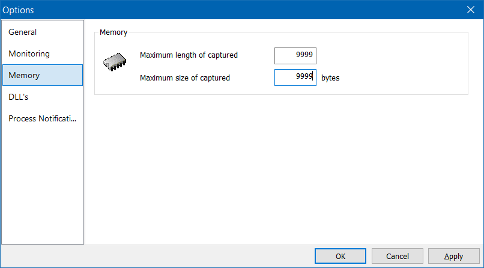

# API Monitor Definitions

## Description

The [WebAuthn.xml](WebAuthn.xml) file contains WebAuthn API definitions for the [Rohitab API Monitor](http://www.rohitab.com/apimonitor).
This allows capturing the entire communication between a browser (i.e. Microsoft Edge, Google Chrome, or Mozilla Firefox) and Windows 10 WebAuthn API.
The file was created by analyzing all definitions in the [webauthn.h](https://github.com/microsoft/webauthn/blob/master/webauthn.h) C header file.

Note that most calls used by the Immersive Control Panel for FIDO2 Security Key management are undocumented.

## Screenshot

## Installation

The [WebAuthn.xml](WebAuthn.xml) file just needs to be copied to the API Monitor's installation path, e.g. `C:\Program Files\rohitab.com\API Monitor\API\`.
The API Monitor then needs to be re-launched.

It is also recommended to increase the maximum size of the captured data, as [clientDataJSON](https://www.w3.org/TR/webauthn/#dom-authenticatorresponse-clientdatajson) can be quite big:

## DLL Injection

Modern browsers contain protection against DLL injection, which is utilized by the API Monitor to intercept function calls.

In Firefox, this protection can be disabled by setting `browser.launcherProcess.enabled` to `false` in `about:config`.
