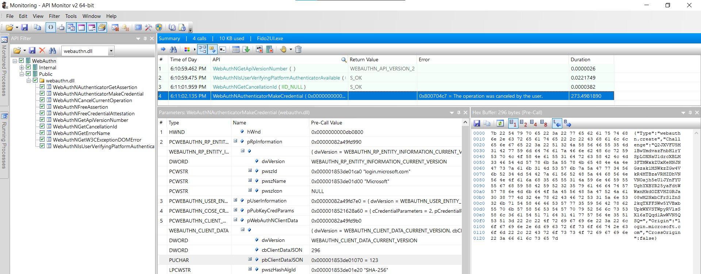

# API Monitor Definitions

## Description
The [WebAuthn.xml](WebAuthn.xml) file contains WebAuthn API definitions for the [Rohitab API Monitor](http://www.rohitab.com/apimonitor).
This allows capturing the entire communication between a browser (i.e. Microsoft Edge, Google Chrome, or Mizilla Firefox) and Windows 10 WebAuthn API.
The file was created by analyzing all definitions in the [webauthn.h](../Src/webauthn/webauthn.h) C header file.

Note that most calls used by the Immersive Control Panel for FIDO2 Security Key management are undocumented.

## Screenshot

## Installation
The [WebAuthn.xml](WebAuthn.xml) file just needs to be copied to the API Monitor's installation path, e.g. `C:\Program Files\rohitab.com\API Monitor\API\`.
The API Monitor then needs to be re-launched.
